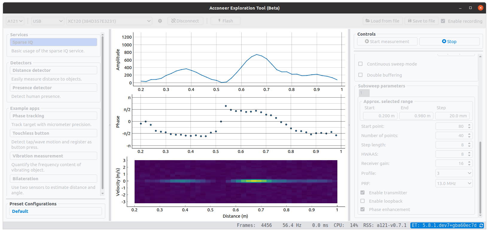

# Acconeer Exploration Tool

_**Explore the Next Sense**_ with Acconeer Exploration Tool! Use one of our [evaluation kits](https://www.acconeer.com/products) together with our Python examples and start exploring the world of Acconeer's radar sensor technology. The Python scripts and application in this repository will help you to easily stream the radar sensor's data to your local machine to start radar sensor evaluation and/or algorithm development for your application.

To run the Python exploration scripts, you will need an [evaluation kit](https://www.acconeer.com/products) running the included Streaming or Module server, which are supplied with the [Acconeer SDK and Module SW](https://developer.acconeer.com/) image.

This release is developed for [Acconeer SDK and Module SW](https://developer.acconeer.com/) **version 2.10.0**.
Running this version is strongly recommended, as we continuously fix bugs and add features.

<p align="center">
  
</p>

## Quickstart for Windows

There is a portable version of the Acconeer Exploration Tool for Windows:

* [Download](https://developer.acconeer.com/download/portable_exploration_tool-zip/) the zip file and extract
* Double click the `update.bat` file and wait for the installation to finish, which might take a couple of minutes
* Double click the `run_app.bat`

For an in-depth evaluation we recommend a full installation as described below.

## Documentation

Additional documentation is available at [docs.acconeer.com](https://docs.acconeer.com).

## Setting up your evaluation kit

* [Raspberry Pi (XC111+XR111 or XC112+XR112)](https://docs.acconeer.com/en/latest/evk_setup/raspberry.html)
* [XM112](https://docs.acconeer.com/en/latest/evk_setup/xm112.html)
* [XM122](https://docs.acconeer.com/en/latest/evk_setup/xm122.html)
* [XM132](https://docs.acconeer.com/en/latest/evk_setup/xm132.html)

For general help on getting started head over to the [Acconeer developer page](https://developer.acconeer.com/). There you will find both a getting started guide and a video showing you how to set up your evaluation kit. There you will also find the SDK download.

## Setting up your local machine

### Requirements

Python 3.7 or newer. Older versions have limited or no support.

Tested on:

* Python 3 (developed and tested on 3.7, 3.8 and 3.9)
* Windows 10
* Ubuntu 18.04 and 20.04

### Setup

#### Installing the `acconeer-exptool` package

**NEW:** Install from PyPI:
```
python -m pip install acconeer-exptool[app]
```
> *Depending on your environment, you might have to replace `python` with `python3` or `py`.*

The Exploration Tool application uses PySide6.
If you have other versions of PyQt/PySide installed, it may cause conflicts.
If this is the case for you, we recommend using virtual environments to separate the two installations.

#### Windows COM port drivers

If no COM port is recognized when plugging in a module, you might need to install a driver:

* XM112, XM122: [FTDI](https://ftdichip.com/drivers/vcp-drivers/)
* XM132: [Silicon Labs](https://www.silabs.com/developers/usb-to-uart-bridge-vcp-drivers)

#### Linux dependencies

To run the application on Ubuntu 20.04, `libxcb-xinerama0-dev` needs to be installed:
```
sudo apt update
sudo apt install -y libxcb-xinerama0-dev
```

#### Connecting to a module through UART on Linux

If you are running Linux together with an XM112, XM122, or XM132 module through UART, you probably need permission to access the serial port. Access is obtained by adding yourself to the dialout group:
```
sudo usermod -a -G dialout $USER
```
Reboot for the changes to take effect.

Note: If you have ModemManager installed and running it might try to connect to the module, which has proven to cause problems. If you are having issues, try disabling the ModemManager service.

#### Connecting to an XM112 through SPI on Linux

If you are using Linux together with an XM112, you probably need permission to access the SPI bridge USB device. Either run the scripts with `sudo`, or create an udev rule as follows. Create and edit:
```
sudo nano /etc/udev/rules.d/50-ft4222.rules
```
with the following content:
```
SUBSYSTEM=="usb", ATTRS{idVendor}=="0403", ATTRS{idProduct}=="601c", MODE:="0666"
```
This method is confirmed to work for **Ubuntu 18.04 and 20.04**.

## Application

Using the application is the easiest way to start exploring Acconeer's radar sensor and our application examples:
```
python -m acconeer.exptool.app
```
> *Depending on your environment, you might have to replace `python` with `python3` or `py`.*

In the top right box of the application, named _Connection_, select the interface you wish to use
- SPI: auto-detects an XM112 connected to USB2 (USB1 is also needed for power)
- Socket: specify the IP address of your Raspberry Pi running the streaming server
- Serial: specify the serial port that is assigned to the sensor

Connections via *Serial* have the option of choosing a *Protocol*. The choices are
**Module** and **Exploration**, where the protocol should match the server installed
on the module (*Module server* or *Exploration server*, respectively). Choosing the wrong
protocol will show an error.

After pressing _Connect_, a connection should be established.
In the box below labeled _Scan controls_, select the service or processing example you want to test.
Now you may tune the sensor and processing settings to your specific setup.
Once you press _Start measurement_, the application will start fetching data from the sensor and plotting the results.
After pressing _Stop_, you can save (and later load data) or just replay the data stored in the buffer.

### The ML interface *(no longer supported)*

Support for the Machine Learning interface in Exploration Tool have been dropped.

If you still need to use it, it is possible use and old version of Exploration Tool.

From the `acconeer-python-exploration` directory:

```
git checkout v3
```

And follow the instructions in an old version of this document (`README.md`).

Note that this version of Exploration Tool will not be actively supported. Compatibility with new
RSS versions **is not guaranteed** .

## Running an example script on your local machine

If you prefer using the command line for testing and evaluation of our examples you can use the following instructions.

XC111+XR111 or XC112+XR112 (mounted on a Raspberry Pi):

```
python examples/a111/basic.py -s <your Raspberry Pi IP address>
```

XM112+XB112 via SPI over USB:

```
python examples/a111/basic.py -spi
```

Any module via UART over USB, attempting to auto-detect the serial port:

```
python examples/a111/basic.py -u
```

Any module via UART over USB, using a specific serial port:

```
python examples/a111/basic.py -u <the serial port, for example COM3>
```

> *Depending on your environment, you might have to replace `python` with `python3` or `py`.*

Choosing which sensor(s) to be used can be done by adding the argument `--sensor <id 1> [id 2] ...`. The default is the sensor on port 1. This is not applicable for the modules.

Scripts can be terminated by pressing Ctrl-C in the terminal.

## Examples

### Basic: `examples/a111/`

The basic scripts contains a lot of comments guiding you through the steps taken in most example scripts. We recommend taking a look at these scripts before working with the others.

- `basic.py` \
  Basic script for getting data from the radar. **Start here!**
- `basic_continuous.py` \
  Basic script for getting data continuously that serves as the base for most other examples.

### Services: `examples/a111/services/`

- `power_bins.py` ([doc](https://docs.acconeer.com/en/latest/services/pb.html)) \
  Demonstrates the power bins service.
- `envelope.py` ([doc](https://docs.acconeer.com/en/latest/services/envelope.html)) \
  Demonstrates the envelope service.
- `iq.py` ([doc](https://docs.acconeer.com/en/latest/services/iq.html)) \
  Demonstrates the IQ service.
- `sparse.py` ([doc](https://docs.acconeer.com/en/latest/services/sparse.html)) \
  Demonstrates the Sparse service.

### Record data: `examples/a111/record_data/`

- `barebones.py` \
  A barebones stub that demonstrates how to save sensor data to file.
- `with_cli.py` \
  A stub for saving sensor data to file that uses command line arguments
  allowing you to set the filename, etc.
- `long_duration_split_files.py` \
  A stub that demonstrates how you can split one recording session into multiple files.

### Plotting: `examples/a111/plotting/`

- `plot_with_matplotlib.py` \
  Example of how to use matplotlib for plotting.
- `plot_with_pyqtgraph.py` \
  Example of how to use PyQtGraph for plotting.

## Disclaimer

Here you find the [disclaimer](https://docs.acconeer.com/en/latest/disclaimer.html).

## FAQ and common issues

See the [FAQ](https://docs.acconeer.com/en/latest/faq.html) on the Acconeer documentation pages.
